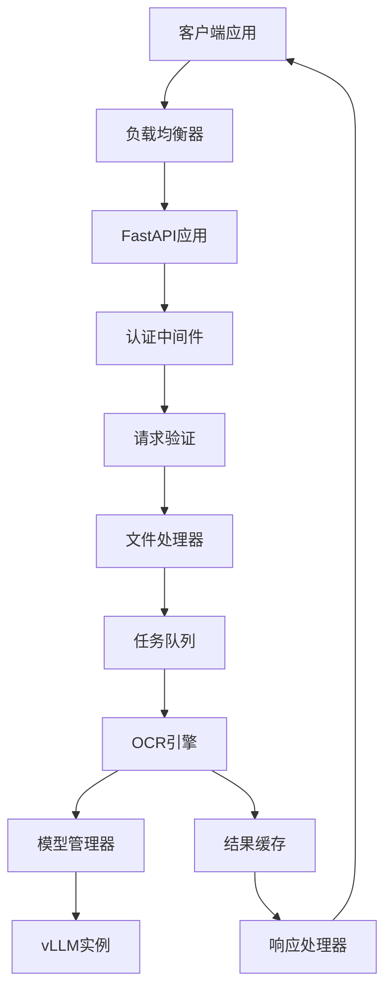
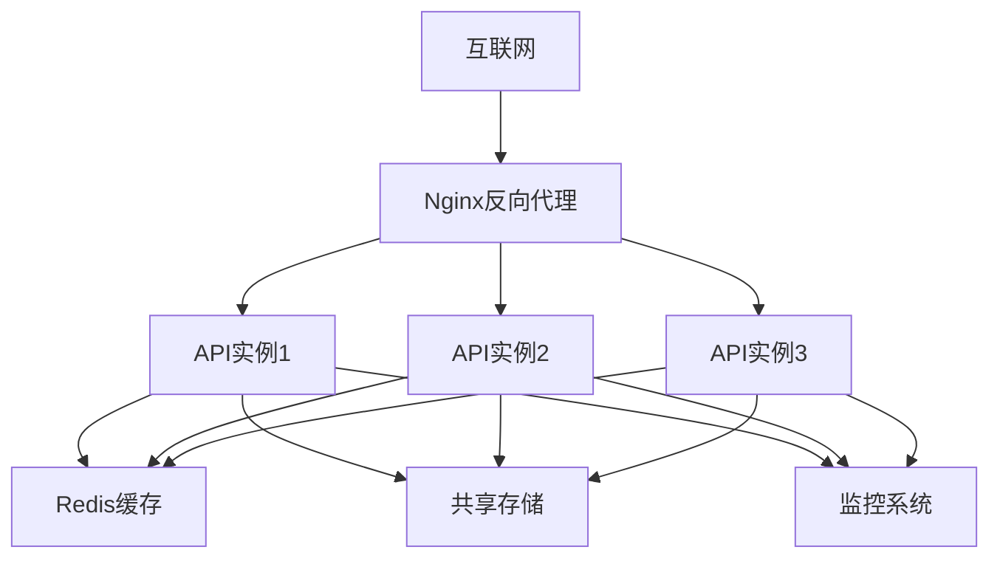

# Design Document

## Overview

OCRFlux API Service是一个基于FastAPI的REST API服务，将OCRFlux的PDF和图像转Markdown功能封装为易于使用的HTTP接口。服务采用异步架构，支持单文件和批量文件处理，提供完整的OpenAPI文档和错误处理机制。

## Architecture

### 系统架构图



### 核心组件

1. **FastAPI应用层**：处理HTTP请求和响应
2. **文件处理器**：管理文件上传、验证和临时存储
3. **任务队列**：处理异步任务和批量处理
4. **OCR引擎**：封装OCRFlux核心功能
5. **模型管理器**：管理vLLM模型实例的生命周期
6. **结果缓存**：缓存处理结果以提高性能

## Components and Interfaces

### 1. API路由层 (api/routes/)

#### 主要接口

```python
# 单文件处理接口
POST /api/v1/parse
Content-Type: multipart/form-data
Parameters:
  - file: 上传的PDF或图片文件
  - skip_cross_page_merge: bool (可选，默认false)
  - max_page_retries: int (可选，默认1)

# 批量文件处理接口  
POST /api/v1/batch
Content-Type: multipart/form-data
Parameters:
  - files: 多个PDF或图片文件
  - skip_cross_page_merge: bool (可选，默认false)
  - max_page_retries: int (可选，默认1)

# 异步任务状态查询
GET /api/v1/tasks/{task_id}

# 异步任务结果获取
GET /api/v1/tasks/{task_id}/result

# 健康检查
GET /api/v1/health

# OpenAPI Schema
GET /openapi.json
GET /docs (Swagger UI)
GET /redoc (ReDoc)
```

### 2. 文件处理器 (core/file_handler.py)

```python
class FileHandler:
    async def validate_file(self, file: UploadFile) -> bool
    async def save_temp_file(self, file: UploadFile) -> str
    async def cleanup_temp_file(self, file_path: str) -> None
    def get_file_info(self, file_path: str) -> FileInfo
```

### 3. OCR引擎 (core/ocr_engine.py)

```python
class OCREngine:
    def __init__(self, model_path: str)
    async def process_single_file(self, file_path: str, options: ProcessOptions) -> ProcessResult
    async def process_batch_files(self, file_paths: List[str], options: ProcessOptions) -> List[ProcessResult]
    def get_engine_status(self) -> EngineStatus
```

### 4. 模型管理器 (core/model_manager.py)

```python
class ModelManager:
    def __init__(self, model_path: str)
    async def load_model(self) -> None
    async def get_model_instance(self) -> LLM
    def is_model_ready(self) -> bool
    async def health_check(self) -> ModelHealth
```

### 5. 任务队列 (core/task_queue.py)

```python
class TaskQueue:
    async def submit_task(self, task: Task) -> str  # 返回task_id
    async def get_task_status(self, task_id: str) -> TaskStatus
    async def get_task_result(self, task_id: str) -> TaskResult
    async def cleanup_completed_tasks(self) -> None
```

## Data Models

### 请求模型

```python
class ProcessOptions(BaseModel):
    skip_cross_page_merge: bool = False
    max_page_retries: int = 1
    target_longest_image_dim: int = 1024

class BatchProcessRequest(BaseModel):
    options: ProcessOptions = ProcessOptions()
```

### 响应模型

```python
class ProcessResult(BaseModel):
    success: bool
    file_name: str
    num_pages: int
    document_text: str
    page_texts: Dict[str, str]
    fallback_pages: List[int]
    processing_time: float
    error_message: Optional[str] = None

class BatchProcessResponse(BaseModel):
    total_files: int
    successful_files: int
    failed_files: int
    results: List[ProcessResult]
    processing_time: float

class TaskStatus(BaseModel):
    task_id: str
    status: str  # pending, processing, completed, failed
    progress: float  # 0.0 to 1.0
    created_at: datetime
    updated_at: datetime
    estimated_completion: Optional[datetime] = None

class HealthResponse(BaseModel):
    status: str  # healthy, unhealthy, degraded
    model_loaded: bool
    model_path: str
    memory_usage: Dict[str, float]
    uptime: float
    version: str
```

### 错误模型

```python
class ErrorResponse(BaseModel):
    error_code: str
    error_message: str
    details: Optional[Dict[str, Any]] = None
    timestamp: datetime
    request_id: str
```

## Error Handling

### 错误分类和处理策略

1. **文件相关错误 (4xx)**
   - 文件格式不支持：400 Bad Request
   - 文件大小超限：413 Payload Too Large
   - 文件损坏：422 Unprocessable Entity

2. **服务相关错误 (5xx)**
   - 模型未加载：503 Service Unavailable
   - 处理超时：504 Gateway Timeout
   - 内存不足：507 Insufficient Storage

3. **业务逻辑错误**
   - OCR处理失败：返回部分结果和错误信息
   - 跨页合并失败：降级到简单拼接

### 错误处理中间件

```python
@app.exception_handler(Exception)
async def global_exception_handler(request: Request, exc: Exception):
    error_id = str(uuid.uuid4())
    logger.error(f"Error {error_id}: {str(exc)}", exc_info=True)
    
    return JSONResponse(
        status_code=500,
        content=ErrorResponse(
            error_code="INTERNAL_ERROR",
            error_message="An internal error occurred",
            details={"error_id": error_id},
            timestamp=datetime.utcnow(),
            request_id=request.headers.get("X-Request-ID", "unknown")
        ).dict()
    )
```

## Testing Strategy

### 单元测试

1. **文件处理器测试**
   - 文件验证逻辑
   - 临时文件管理
   - 文件信息提取

2. **OCR引擎测试**
   - 单文件处理功能
   - 批量处理功能
   - 错误处理机制

3. **模型管理器测试**
   - 模型加载和卸载
   - 健康检查功能
   - 并发访问处理

### 集成测试

1. **API端点测试**
   - 所有HTTP接口的功能测试
   - 参数验证测试
   - 错误响应测试

2. **端到端测试**
   - 完整的文件上传到结果返回流程
   - 异步任务处理流程
   - 批量处理流程

### 性能测试

1. **负载测试**
   - 并发请求处理能力
   - 大文件处理性能
   - 内存使用情况

2. **压力测试**
   - 系统极限处理能力
   - 错误恢复能力
   - 资源泄漏检测

### 测试数据

```python
# 测试用例数据结构
test_cases = [
    {
        "name": "single_pdf_basic",
        "file": "test_documents/simple.pdf",
        "expected_pages": 1,
        "expected_content_contains": ["title", "paragraph"]
    },
    {
        "name": "multi_page_pdf_with_tables",
        "file": "test_documents/complex.pdf", 
        "expected_pages": 5,
        "expected_content_contains": ["<table>", "</table>"]
    },
    {
        "name": "image_with_text",
        "file": "test_documents/document.png",
        "expected_pages": 1,
        "expected_content_contains": ["text content"]
    }
]
```

## Configuration

### 环境配置

```python
class Settings(BaseSettings):
    # 服务配置
    app_name: str = "OCRFlux API Service"
    app_version: str = "1.0.0"
    debug: bool = False
    host: str = "0.0.0.0"
    port: int = 8000
    
    # 模型配置
    model_path: str = "/path/to/OCRFlux-3B"
    model_max_context: int = 8192
    gpu_memory_utilization: float = 0.8
    
    # 文件处理配置
    max_file_size: int = 100 * 1024 * 1024  # 100MB
    allowed_extensions: List[str] = [".pdf", ".png", ".jpg", ".jpeg"]
    temp_dir: str = "/tmp/ocrflux"
    
    # 任务队列配置
    max_concurrent_tasks: int = 4
    task_timeout: int = 300  # 5分钟
    result_cache_ttl: int = 3600  # 1小时
    
    # 日志配置
    log_level: str = "INFO"
    log_file: str = "ocrflux_api.log"
    
    class Config:
        env_file = ".env"
```

### Docker配置

```dockerfile
FROM python:3.11-slim

# 安装系统依赖
RUN apt-get update && apt-get install -y \
    poppler-utils \
    poppler-data \
    fonts-liberation \
    && rm -rf /var/lib/apt/lists/*

# 设置工作目录
WORKDIR /app

# 复制依赖文件
COPY requirements.txt .
RUN pip install --no-cache-dir -r requirements.txt

# 复制应用代码
COPY . .

# 暴露端口
EXPOSE 8000

# 启动命令
CMD ["uvicorn", "main:app", "--host", "0.0.0.0", "--port", "8000"]
```

## Deployment

### 部署架构



### 部署配置

1. **Nginx配置**
   - 负载均衡
   - 文件上传大小限制
   - 超时设置

2. **Docker Compose配置**
   - 多实例部署
   - 资源限制
   - 健康检查

3. **监控配置**
   - Prometheus指标收集
   - Grafana仪表板
   - 日志聚合

### 扩展性考虑

1. **水平扩展**：支持多实例部署
2. **模型共享**：多实例共享模型权重
3. **缓存策略**：Redis缓存常用结果
4. **异步处理**：支持大文件异步处理